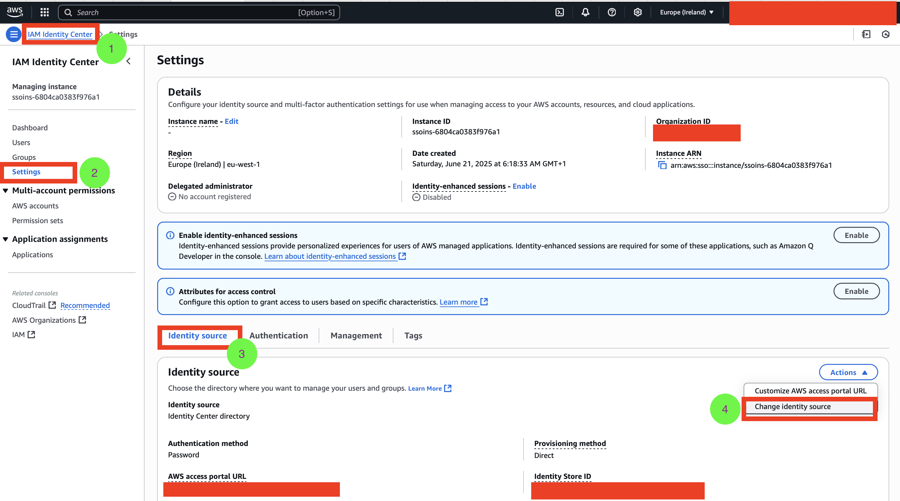
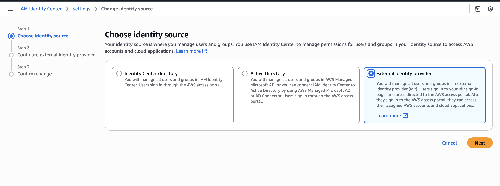
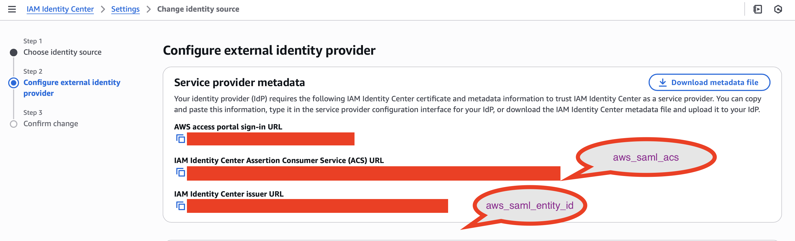
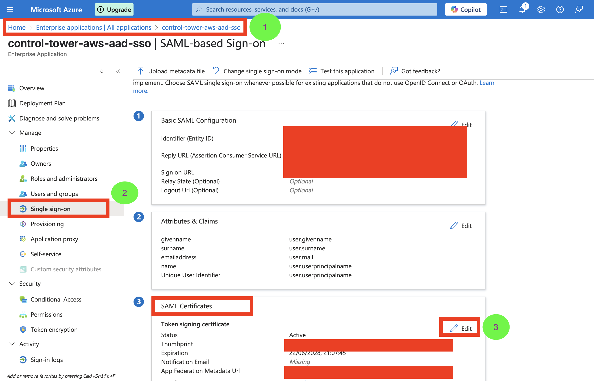
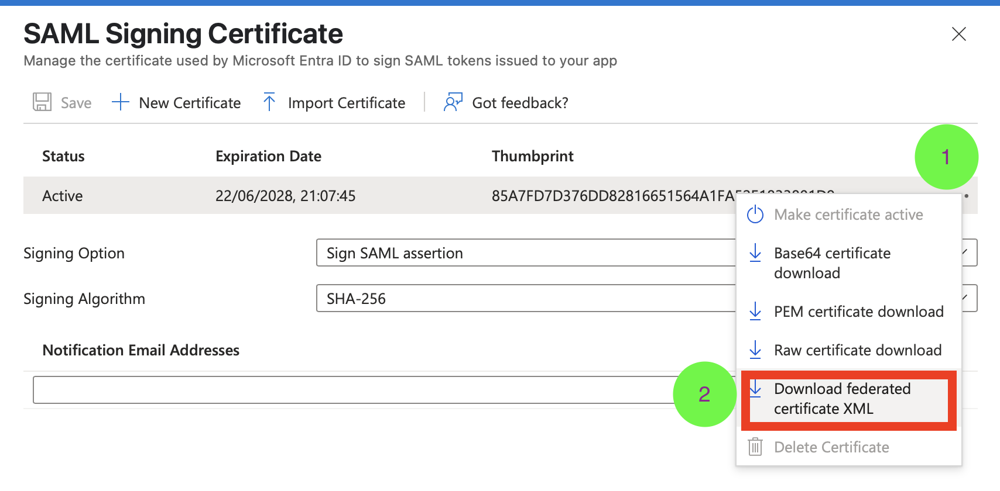
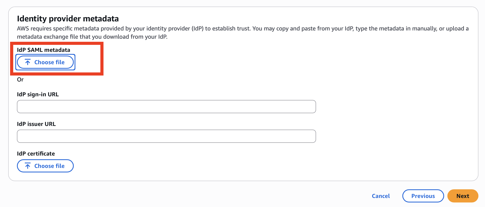
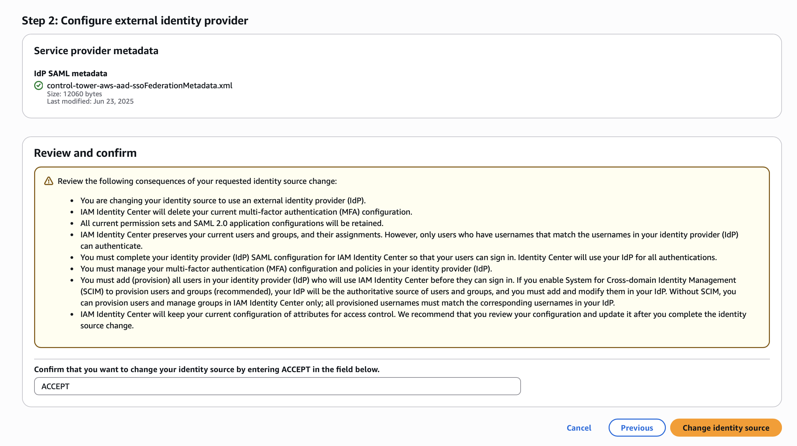
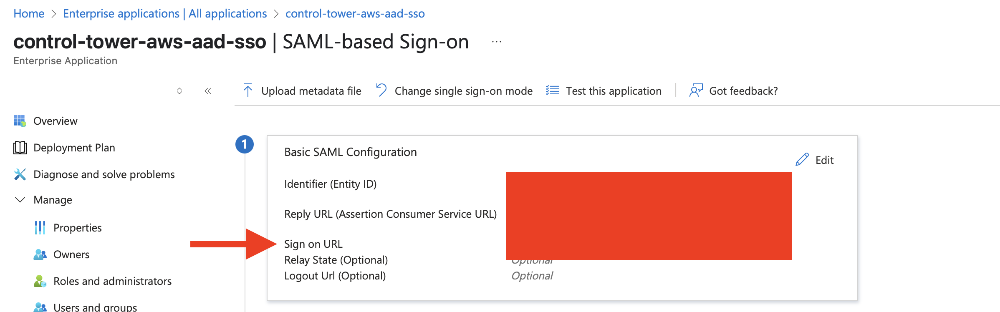
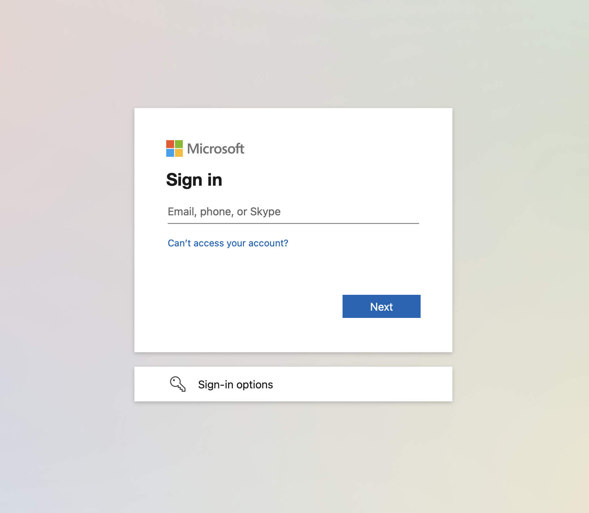

# Azure AD ↔ AWS IAM Identity Center (SSO) Integration

This repository provisions the end-to-end integration between **Azure Active Directory (Microsoft Entra)** and **AWS IAM Identity Center (formerly AWS SSO)**. It automates:

- Azure AD application with SAML configuration and dynamic app roles
- Azure AD users and their role assignments
- AWS IAM Identity Center users, groups, group memberships
- SSO permission sets mapped to Azure AD app roles

## 📁 Project Structure (key components only)

```bash
.
├── assets/                      # Screenshots and logo for Azure app
│   └── logo.png                # Logo used in Azure AD Application
├── main.tf                     # Core Terraform configuration
├── locals.tf                   # Identity user/role definitions
├── variables.tf                # Global variables
├── terraform.tfvars            # Actual variable values
├── outputs.tf                  # Useful outputs (login URL, credentials)
├── init/                       # Initialization module to set up S3 backend
│   └── main.tf
├── modules/
│   ├── aws-iam/                # AWS IAM Identity Center provisioning
│   │   ├── iam-groups.tf
│   │   ├── iam-permissions.tf
│   │   ├── iam-users.tf
│   └── azure-ad/               # Azure AD application, users, roles
│       ├── azure-application.tf
│       ├── azure-users.tf
```

---

## 🚀 Quickstart

### 🟠 Step 1: Initialize the Remote Backend

Run the backend bootstrap once:

```bash
cd init
terraform init
terraform apply
```

Copy the output value:
```hcl
bucket_name = "<your-s3-bucket-name>"
```

Use it to configure your `backend.tf` in the root folder.

---

### 🟡 Step 2: Populate Required Variables

All variables are stored in `terraform.tfvars`:

```hcl
john_user_email         = "john.doe@yourdomain.com"
jane_user_email         = "jane.smith@yourdomain.com"
aws_saml_entity_id      = "SEE_SCREENSHOT_BELOW"
aws_saml_acs            = "SEE_SCREENSHOT_BELOW"
```

> 📝 Tip: You can extract `aws_saml_entity_id` and `aws_saml_acs` from the IAM Identity Center Console

 **Before Terraform Apply**
   - Go to IAM Identity Center → Settings → Identity source → **Copy**:
     - IAM Identity Center Assertion Consumer Service (ACS) URL
     - IAM Identity Center Issuer URL
     → Add them to `terraform.tfvars`






---

### 🟢 Step 3: Deploy the Full Infrastructure

```bash
cd ..
terraform init
terraform apply
```

This provisions:

- Azure AD application with roles: `Platform`, `Product`
- Azure AD users: `Jane Smith`, `John Doe`
- AWS Identity Center groups + permission sets
- Role mappings from Azure to AWS IAM Identity Center

---

## 🧑‍💼 Manual Steps with Visual Guide 📸

1. **After Terraform Apply**
   - Go to Azure AD → Enterprise Applications → Select the app → **Single sign-on** → Download **Federation Metadata XML**
   - Upload it to AWS under “Change identity source” step
   
   
   
   

2. **Verify the SSO Login**
   - Visit the AWS access portal URL:
     ```bash
     terraform output aws_access_portal_url
     ```
   - You should see the Microsoft Azure login page:
     
     


---

## 📦 Feature: Support for Member and Guest Users

This setup now supports both Member and Guest user types in Azure AD. Each user definition in locals.tf must now include:

  azure_ad_user_type = "Member" # or "Guest"

	- Member users are created inside the directory and get a password output
	- Guest users are invited via azuread_invitation and receive a redirect to log in
	- Role assignments are dynamically handled based on type


###  📤 Output for Member Users

If you provision any Member users, Terraform will output their credentials:

```bash
terraform output -json user_credentials


{
  "jane": {
    "username": "jane.smith@yourdomain.com",
    "password": "********"
  }
}
```

> ⚠️ This is only available for Member-type users. Guest users sign in via invitation email.


### 📁 Example locals.tf

```hcl
locals {
  identity_users = {
    jane = {
      user_principal_name          = var.jane_user_email
      display_name                 = "Jane Smith"
      given_name                   = "Jane"
      surname                      = "Smith"
      email                        = var.jane_user_email
      mail_nickname                = "jane.smith"
      role                         = "platform"
      azure_ad_user_type           = "Member"
    },
    john = {
      user_principal_name          = var.john_user_email
      display_name                 = "John Doe"
      given_name                   = "John"
      surname                      = "Doe"
      email                        = var.john_user_email
      mail_nickname                = "john.doe"
      role                         = "product"
      azure_ad_user_type           = "Guest"
    }
  }
}
```
---

## 🧩 Design Notes

- Dynamic role creation via `azure_app_roles` and `identity_users_roles`
- Terraform modules are cleanly separated for Azure and AWS
- All user details are injected via `locals.tf` and `tfvars`, no hardcoded emails
- Logo passed via `filebase64("${path.module}/assets/logo.png")`

---

## ✅ Prerequisites

- Azure AD tenant with admin access
- AWS IAM Identity Center already enabled
- Terraform 1.3+
- AWS CLI + Azure CLI authenticated

---

## 📬 Support

Open a PR or issue for enhancements. Feel free to fork and adapt to your org's needs!
